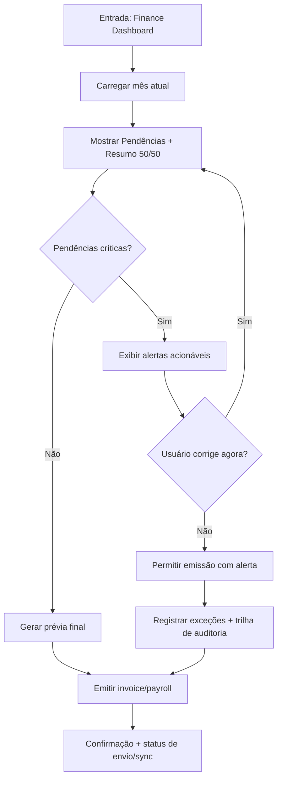
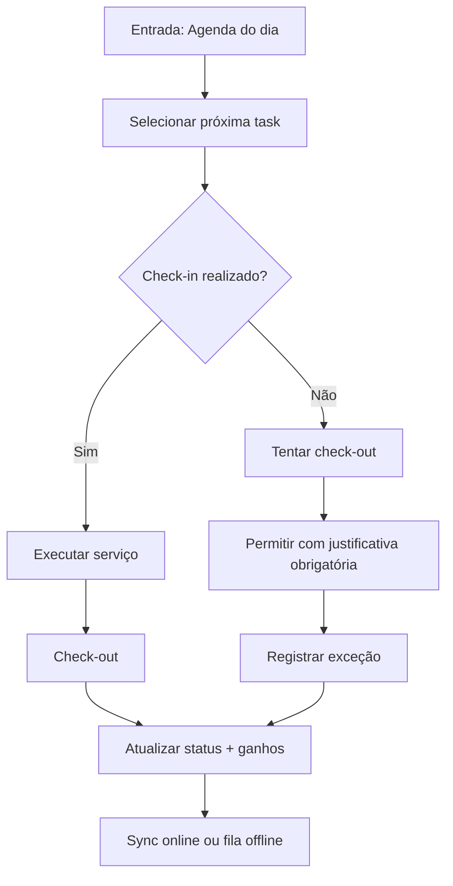
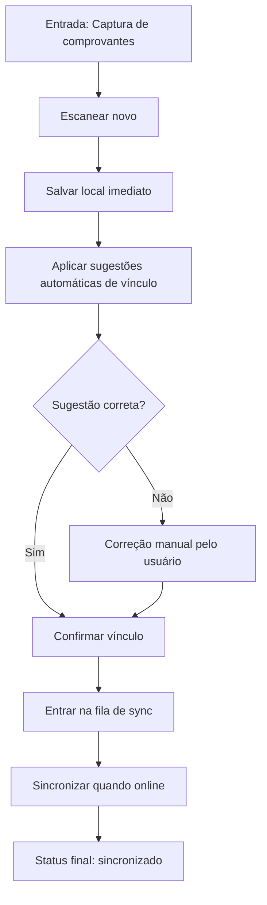

# UX Design Specification gorda

**Author:** Carlos
**Date:** 2026-02-19 23:31:29 PST

---

<!-- UX design content will be appended sequentially through collaborative workflow steps -->

## Executive Summary

### Project Vision

Criar um app iOS offline-first para gestão de serviços residenciais que elimine a contabilidade manual, centralize comprovantes e permita ao Manager fechar faturamento mensal de clientes e payroll com alta confiabilidade e mínimo esforço operacional, mesmo em contexto de campo com internet instável.

### Target Users

- **Manager (usuário principal de fechamento financeiro):** responsável por consolidar despesas, reembolsos, invoices mensais e payroll da equipe.
- **Employee (usuário operacional de campo):** precisa acessar tarefas diárias com rapidez, registrar execução e acompanhar ganhos.
- **Perfil técnico dos usuários:** nível digital médio.
- **Dispositivo principal:** iPhone.
- **Contexto de uso:** predominantemente em campo e deslocamento, com conectividade ruim/intermitente.

### Key Design Challenges

- Projetar fluxos críticos (comprovantes, invoices, payroll) para funcionar bem offline e sincronizar sem perda/confusão.
- Reduzir a fricção do fechamento mensal financeiro para um fluxo curto, claro e auditável.
- Substituir o processo baseado em “papeizinhos” por um pipeline digital confiável de captura e organização de comprovantes.
- Entregar visualização imediata de tarefas e ganhos para Employee sem sobrecarga de informação.

### Design Opportunities

- Implementar um fluxo “fechamento mensal” com poucos passos e forte automação (validação e consolidação automática).
- Tornar captura de comprovantes extremamente rápida (scan/câmera) com associação automática ao cliente/lançamento.
- Diferenciar fortemente a experiência por papel:
  - Manager: controle, pendências, fechamento e qualidade de dados.
  - Employee: agenda do dia, status e ganhos.
- Transformar o app em fonte única de verdade financeira-operacional, reduzindo retrabalho e erro humano.

## Core User Experience

### Defining Experience

A experiência central de gorda é orientada ao fechamento financeiro mensal pelo Manager, com fluxo contínuo de operação diária em campo para Employee. O núcleo de valor é transformar dados operacionais (tasks, comprovantes, check-in/check-out) em contabilidade pronta para invoice/payroll com mínimo esforço manual.

### Platform Strategy

- Plataforma principal: iPhone.
- Interação primária: touch-first, uso rápido em contexto de campo e deslocamento.
- Prioridade de operação: conectividade intermitente/ruim.
- Requisito estrutural: offline-first para ações críticas e sincronização posterior confiável.

### Effortless Interactions

As interações que devem ser praticamente sem atrito são:

- Fechamento mensal do Manager (invoice + payroll) com fluxo curto e guiado.
- Captura de comprovantes e vínculo ao contexto correto (cliente/task/lançamento).
- Consulta imediata de agenda diária pelo Employee.
- Check-in/check-out rápido em campo.

Automação esperada:

- Sugestão automática de associação de comprovantes.
- Consolidação automática de valores para prévia de invoice/payroll.
- Validação automática de inconsistências antes do fechamento.

### Critical Success Moments

Momentos críticos de sucesso:

- O Manager fecha o mês com segurança e baixo esforço, percebendo “contabilidade pronta”.
- O Employee abre o app e vê imediatamente o que precisa executar no dia.
- O fluxo de comprovantes elimina dependência de registros manuais dispersos.
- Check-in/check-out funciona com fluidez em contexto real de campo.

Falhas nesses pontos comprometem a percepção de valor do produto.

### Experience Principles

1. **Fechamento sem fricção:** o fluxo mensal deve reduzir passos e retrabalho ao mínimo.
2. **Operação de campo em primeiro lugar:** agenda e execução diária devem ser instantâneas, mesmo com internet ruim.
3. **Automação com controle:** sistema automatiza consolidação e validações, mantendo transparência para decisão do Manager.
4. **Clareza por papel:** cada usuário vê apenas o que importa para sua missão (Manager fecha; Employee executa).

## Desired Emotional Response

### Primary Emotional Goals

- **Emoção principal:** controle total com confiança na contabilidade.
- O produto deve transmitir sensação de domínio operacional e financeiro, reduzindo incerteza no fechamento mensal.
- Para o Manager, o estado emocional desejado após tarefas críticas é **alívio**, com sensação de “está resolvido e correto”.

### Emotional Journey Mapping

- **Descoberta/primeiro uso:** sensação de clareza imediata e organização.
- **Uso no dia a dia (Employee):** clareza, agilidade e confiança de que tarefas/ganhos estão corretos.
- **Momento crítico (fechamento mensal):** foco, controle e segurança durante o processo.
- **Após concluir (invoice/payroll):** alívio e redução de carga mental.
- **Cenários de erro/offline:** o app deve comunicar “está tudo salvo, pode seguir” para preservar confiança e continuidade.

### Micro-Emotions

Estados emocionais a maximizar:

- Confiança
- Clareza
- Controle
- Alívio
- Satisfação por produtividade

Estados emocionais a evitar (críticos):

- Confusão
- Ansiedade por risco de erro financeiro
- Desconfiança dos dados
- Frustração por lentidão

### Design Implications

Conexões entre emoção e UX:

- **Controle + confiança** → dashboards e fluxos de fechamento com status explícitos, consistentes e auditáveis.
- **Alívio pós-fechamento** → confirmações fortes de conclusão e resumo final claro do que foi fechado.
- **Clareza/agilidade no campo** → telas de agenda e execução com hierarquia visual objetiva e poucas ações por etapa.
- **“Está tudo salvo” no offline** → feedback persistente de salvamento local e sincronização posterior sem interromper fluxo.
- **Evitar ansiedade/desconfiança** → transparência de cálculos, validações preventivas e mensagens de erro acionáveis.

### Emotional Design Principles

1. **Confiança primeiro:** toda interação crítica deve reforçar precisão e previsibilidade.
2. **Controle sem fricção:** o usuário precisa sentir domínio com o menor esforço possível.
3. **Clareza operacional contínua:** cada tela deve responder “o que preciso fazer agora?”.
4. **Resiliência tranquilizadora:** offline e falhas devem manter o usuário seguro para continuar.
5. **Conclusão com alívio:** finalizações importantes devem reduzir carga mental imediatamente.

## UX Pattern Analysis & Inspiration

### Inspiring Products Analysis

Com base nas referências escolhidas:

- **WhatsApp**
  - **Problema que resolve bem:** comunicação rápida com baixa fricção.
  - **Onboarding:** quase imediato, sem curva longa.
  - **Navegação/hierarquia:** estrutura simples, foco em ações principais.
  - **Interações fortes:** envio de mídia/documentos em poucos toques.
  - **Escolhas visuais:** UI clean, leitura fácil, pouco ruído.
  - **Erros/edge cases:** feedback claro de envio/entrega (importante para internet ruim).

- **Uber**
  - **Problema que resolve bem:** fluxo operacional crítico com estado dinâmico.
  - **Onboarding:** direto ao objetivo principal.
  - **Navegação/hierarquia:** prioriza contexto atual e próximo passo.
  - **Interações fortes:** estados de carregamento e transição muito profissionais.
  - **Escolhas visuais:** clareza de status e progresso.
  - **Erros/edge cases:** tratamento robusto de loading/retry e atualização de estado.

### Transferable UX Patterns

- **Navigation Patterns**
  - Fluxo principal sempre visível e curto (inspirado no WhatsApp).
  - Home orientada à próxima ação crítica (inspirado no Uber).

- **Interaction Patterns**
  - Captura de comprovante em 1-2 toques, com feedback imediato de salvamento.
  - Fechamento mensal guiado passo a passo com estados explícitos.

- **Visual Patterns**
  - Interface limpa, com poucos elementos por tela.
  - Estados de loading/sincronização claros para conectividade intermitente.

### Anti-Patterns to Avoid

Como não foram relatadas frustrações específicas com os apps citados, os anti-patterns prioritários para evitar são:

- Excesso de opções na tela principal.
- Falta de feedback durante sincronização e processamento.
- Fluxos longos para tarefas críticas (scan de comprovante e fechamento mensal).
- Mensagens vagas de erro sem ação recomendada.

### Design Inspiration Strategy

- **What to Adopt**
  - Clareza e simplicidade visual do WhatsApp.
  - Gestão profissional de loading/estado do Uber.
  - Priorização operacional por contexto (campo vs fechamento financeiro).

- **What to Adapt**
  - Adaptar padrões de status em tempo real para arquitetura offline-first (salvo local + sincronização pendente).
  - Adaptar fluxo enxuto para duas personas sem mistura de responsabilidades (Manager e Employee).

- **What to Avoid**
  - Complexidade de navegação em tarefas diárias.
  - Dependência de internet para ações essenciais.

- **Prioridade estratégica definida**
  - D: tudo acima, com prioridade **B > A > C**.
  - B: fechamento financeiro sem erro.
  - A: velocidade no campo.
  - C: simplicidade extrema.

## Design System Foundation

### 1.1 Design System Choice

Adotar **Apple Human Interface Guidelines (HIG)** com **componentes nativos SwiftUI** como fundação principal do design system do gorda.

### Rationale for Selection

A escolha foi baseada nas prioridades definidas:

- **Equilíbrio entre velocidade e flexibilidade** (sem criar sistema do zero).
- **Robustez e previsibilidade** como objetivo principal para uso em campo e cenários offline.
- **Customização visual baixa**, mantendo interface limpa, familiar e com curva de aprendizado curta.
- Melhor aderência ao contexto **iPhone-first**, com comportamento consistente, performance e padrões já validados no ecossistema iOS.
- Manutenção simplificada no longo prazo, sem dependência de biblioteca visual externa.

### Implementation Approach

- Usar componentes nativos SwiftUI como base (`NavigationStack`, `List`, `Form`, `TabView`, `Sheet`, `Alert`, `ProgressView`).
- Estruturar telas por papel (Manager/Employee), reaproveitando padrões de layout e navegação.
- Definir estados explícitos para:
  - carregamento,
  - sincronização offline/online,
  - erro recuperável,
  - sucesso de conclusão.
- Padronizar feedback de ações críticas (scan de comprovante, fechamento mensal, check-in/check-out) com mensagens objetivas e consistentes.
- Priorizar performance e legibilidade em rede instável e uso em movimento.

### Customization Strategy

- Manter identidade visual **clean iOS**, com ajustes pontuais via `AppTheme`:
  - cor primária,
  - tipografia semântica,
  - raio de borda,
  - espaçamento,
  - ícones de status.
- Evitar customizações profundas de componentes nativos.
- Criar componentes próprios apenas onde houver ganho claro de produtividade/clareza:
  - cards de tarefa,
  - cards financeiros,
  - indicadores de status de sync.
- Acessibilidade e manutenção com prioridade **média-alta**:
  - suporte a Dynamic Type,
  - contraste adequado,
  - áreas de toque confortáveis,
  - comportamento previsível entre telas.

## 2. Core User Experience

### 2.1 Defining Experience

A experiência definidora de gorda é **híbrida**:

- **principal:** fechamento mensal guiado pelo Manager (invoices + payroll + comprovantes);
- **secundária:** operação diária de campo do Employee (agenda + check-in/check-out).

Se o fechamento mensal for impecável e a operação diária for fluida, o restante da experiência se sustenta naturalmente.

### 2.2 User Mental Model

O modelo mental dominante do Manager hoje é **manual**:

- papeizinhos,
- memória operacional,
- cálculo e conferência manual.

Expectativa implícita: "não perder nada", "ter segurança de cálculo" e "conseguir fechar mesmo sem internet estável".
Por isso, o app precisa substituir o controle manual sem tirar sensação de domínio.

### 2.3 Success Criteria

Critérios de sucesso da experiência central:

- **Fechar o mês em poucos minutos** (redução forte de tempo operacional).
- **Confiança total nos cálculos** (transparência + consistência).
- **Funcionamento offline sem travar operação** (continuidade em campo e sincronização posterior).

Sinais de sucesso percebido:

- "Consegui fechar rápido."
- "Os números batem."
- "Mesmo sem internet, o trabalho não parou."

### 2.4 Novel UX Patterns

A direção escolhida é de **padrões estabelecidos** (familiaridade primeiro):

- fluxo em etapas claras,
- validação de pendências antes da emissão,
- revisão final objetiva,
- confirmações explícitas de sucesso.

Não depende de interação nova para aprendizado.
A inovação fica na **orquestração offline-first** e na **redução extrema de fricção**, mantendo convenções já conhecidas no iPhone.

### 2.5 Experience Mechanics

Mecânica do fluxo principal (ordem confirmada):

1. **Iniciar fechamento**

- Manager acessa módulo Finance e inicia "Fechar mês".

2. **Validar pendências**

- Sistema verifica pendências críticas (itens sem comprovação, inconsistências, dados incompletos).

3. **Revisar prévia**

- App apresenta prévia consolidada de invoices e payroll com destaque para exceções.

4. **Emitir invoice/payroll**

- Manager confirma emissão; sistema registra conclusão e deixa status claro de envio/sincronização.

Feedback em cada etapa:

- estado atual do processo,
- ação recomendada,
- confirmação de salvamento local quando offline,
- confirmação final de fechamento concluído.

## Visual Design Foundation

### Color System

Direção visual definida: **base clara/branca** com acento em **#533AFD** para elementos de ação.

- **Base / superfícies:** `#FFFFFF`
- **Cor de ação (botões, ícones, links, foco):** `#533AFD`
- **Texto principal:** tom neutro escuro para alta legibilidade (ex.: `#111827`)
- **Texto secundário:** neutro médio (ex.: `#6B7280`)
- **Bordas/divisores:** neutro claro (ex.: `#E5E7EB`)

Mapeamento semântico:

- `primary-background` -> branco
- `primary-action` -> `#533AFD`
- `primary-action-foreground` -> branco
- `secondary-text` -> neutro médio
- `success/warning/error` -> manter semântica padrão iOS para reconhecimento imediato

Estratégia:

- evitar poluição visual;
- usar `#533AFD` principalmente para CTA e estados acionáveis;
- manter áreas de leitura e dados financeiros com baixa saturação visual.

### Typography System

Tipografia escolhida: **SF Pro (nativa Apple)** em toda a interface.

- Mantém consistência com HIG e iOS.
- Excelente legibilidade em contexto de campo.
- Escala tipográfica semântica:
  - Título de tela
  - Seção
  - Corpo
  - Legenda/auxiliar
- Peso tipográfico:
  - semibold para títulos e KPIs
  - regular para conteúdo contínuo
  - medium para rótulos acionáveis

### Spacing & Layout Foundation

Densidade escolhida: **equilibrada**.

- Base de espaçamento: **grid de 8pt**.
- Layout com boa respiração entre cards e blocos críticos.
- Priorizar uma ação principal por área da tela.
- Estrutura por blocos:
  - resumo (topo)
  - conteúdo operacional (meio)
  - ação principal (rodapé fixo quando necessário)
- Em telas críticas (fechamento mensal), usar progressão por etapas com separação visual clara.

### Accessibility Considerations

Nível definido: **padrão iOS**.

- Seguir contrastes mínimos recomendados pela Apple.
- Respeitar Dynamic Type e comportamento nativo de fontes.
- Áreas de toque dentro do padrão iOS (sem customizações agressivas).
- Estados visuais claros para:
  - carregando,
  - salvo offline,
  - sincronizado,
  - erro com ação recomendada.

## Design Direction Decision

### Design Directions Explored

Foram exploradas variações de layout por objetivo crítico, mantendo a mesma base visual do produto (fundo branco, cor de ação #533AFD, tipografia SF Pro, CTA principal no bottom acima da tab bar).

Objetivos avaliados:

- OBJ1: Fechar fatura mensal + payroll (Manager)
- OBJ2: Tasks diárias + ganhos (Employee)
- OBJ3: Inserção de comprovantes via scan
- OBJ4: Emissão de invoices mensais

### Chosen Direction

Decisão final por objetivo:

- OBJ1 = **D (Split 50/50)**
  Pendências e resumo financeiro com peso equivalente para apoiar decisão rápida com contexto completo.
- OBJ2 = **A (Lista direta)**
  Sequência objetiva de tarefas com ação imediata para operação de campo.
- OBJ3 = **A (Camera-first)**
  Captura de comprovante priorizada com mínimo de toques e foco em velocidade.
- OBJ4 = **A (Resumo + emitir)**
  Fluxo direto para emissão mensal com resumo compacto e CTA final claro.

### Design Rationale

A combinação escolhida favorece:

- clareza operacional por objetivo de tela (sem misturar contextos);
- velocidade de execução em campo;
- confiança no fechamento mensal com visão balanceada de pendências e valores;
- redução de carga cognitiva com layouts diretos e previsíveis;
- consistência de interação com CTA principal sempre no rodapé, acima da navegação por ícones.

### Implementation Approach

- Aplicar uma estratégia **multi-layout por objetivo**, mantendo tokens visuais únicos.
- Reutilizar os mesmos componentes-base (cards, rows, estados, CTA, tab bar).
- Garantir consistência de navegação e feedback offline em todos os objetivos.
- Priorizar implementação incremental:
  1. OBJ1 (fechamento/payout)
  2. OBJ3 (captura de comprovantes)
  3. OBJ4 (emissão)
  4. OBJ2 (agenda e ganhos)

## User Journey Flows

### J1 • Fechamento Mensal (Manager)

Objetivo: fechar invoice/payroll com visão equilibrada de pendências e resumo financeiro.

### J2 • Operação Diária (Employee)

Objetivo: executar tarefas rapidamente em campo e visualizar ganhos.

### J3 • Comprovantes (Scan + Offline)

Objetivo: capturar comprovantes sem perda e vincular corretamente.

### Journey Patterns

- Entrada sempre por contexto principal da tarefa (Finance, Agenda, Captura).
- CTA principal no rodapé, acima da tab bar.
- Feedback explícito de estado: salvo local, pendente sync, sincronizado.
- Exceções sempre com rastreabilidade (alerta/justificativa/auditoria).

### Flow Optimization Principles

- Reduzir passos até valor real (fechar mês, concluir task, salvar comprovante).
- Mostrar apenas decisões necessárias por etapa.
- Permitir continuidade offline sem interromper trabalho.
- Preservar confiança com logs de exceção e confirmações claras.
- Priorizar previsibilidade em fluxos críticos financeiros.

## Component Strategy

### Design System Components

Componentes base disponíveis via SwiftUI/HIG:

- `NavigationStack`, `TabView`, `List`, `Form`, `Sheet`, `Alert`, `ProgressView`
- `Toolbar`, `Menu`, `TextField`, `Toggle`, `Picker`, `DatePicker`
- `Section`, `DisclosureGroup`, `Label`, padrões de badge/estado com estilo nativo

### Custom Components

#### PrimaryBottomCTA

**Purpose:** botão principal fixo no rodapé, acima da tab bar.  
**Usage:** ações críticas de OBJ1/OBJ3/OBJ4.  
**Anatomy:** label principal, opcional ícone, estado de progresso.  
**States:** default, loading, disabled, success, error.  
**Variants:** full-width padrão; compact para folhas modais.  
**Accessibility:** label explícito + hint da ação crítica; área de toque padrão iOS.  
**Content Guidelines:** verbo de ação direta ("Emitir agora", "Escanear novo").  
**Interaction Behavior:** feedback imediato de toque, bloqueio em loading.

#### FinanceSplitSummaryCard

**Purpose:** exibir pendências + resumo financeiro com peso 50/50 (OBJ1=D).  
**Usage:** home financeira e pré-emissão mensal.  
**Anatomy:** bloco pendências, bloco valores, status geral.  
**States:** normal, com-alertas, bloqueado, parcial-offline.  
**Variants:** mensal atual / histórico curto.  
**Accessibility:** leitura linear clara para VoiceOver.  
**Content Guidelines:** destacar números principais e contagem de exceções.  
**Interaction Behavior:** toque abre detalhe da seção selecionada.

#### TaskDirectListCard

**Purpose:** lista direta de tasks com ação imediata (OBJ2=A).  
**Usage:** agenda diária do Employee.  
**Anatomy:** horário, cliente, status, CTA contextual, ganho estimado.  
**States:** pendente, em andamento, concluída, offline.  
**Variants:** item normal e item prioritário.  
**Accessibility:** alvo de toque amplo por linha.  
**Content Guidelines:** texto curto e orientado à próxima ação.  
**Interaction Behavior:** swipe opcional + toque principal abre detalhe.

#### EvidenceCaptureQuickPanel

**Purpose:** fluxo scan-first com fila offline visível (OBJ3=A).  
**Usage:** captura e vínculo de comprovantes.  
**Anatomy:** CTA escanear, fila pendente, sugestões de vínculo.  
**States:** offline, syncing, synced, sugestão-incerta.  
**Variants:** compacto (lista) e expandido (detalhe).  
**Accessibility:** anúncios claros de status de salvamento.  
**Content Guidelines:** prioridade para estado de fila e próximo passo.  
**Interaction Behavior:** salvar local imediato antes de qualquer sync.

#### InvoiceEmitSummaryPanel

**Purpose:** resumo final e emissão one-click (OBJ4=A).  
**Usage:** etapa final do fechamento mensal.  
**Anatomy:** totais, canais, indicadores de prontidão, CTA final.  
**States:** pronto, com-alerta, enviando, enviado, falha-parcial.  
**Variants:** emissão completa e emissão parcial controlada.  
**Accessibility:** confirmação explícita antes e depois da emissão.  
**Content Guidelines:** foco em números finais e risco operacional.  
**Interaction Behavior:** confirma, executa, retorna status auditável.

#### SyncStatusPill

**Purpose:** estado global de sincronização em formato compacto.  
**Usage:** topo de telas críticas e listas operacionais.  
**States:** salvo local, pendente sync, sincronizado, erro.  
**Accessibility:** texto e cor não dependem apenas um do outro.

#### ExceptionReasonSheet

**Purpose:** coletar justificativa obrigatória em exceções operacionais.  
**Usage:** p.ex. check-out sem check-in.  
**States:** input válido, inválido, salvando, salvo.  
**Accessibility:** foco no campo ao abrir, validação textual clara.

### Component Implementation Strategy

- Construir custom components sobre tokens já definidos (`#533AFD`, branco, SF Pro, spacing 8pt).
- Reutilizar estrutura visual padrão: header -> conteúdo -> CTA bottom.
- Padronizar estados offline/erro/sucesso entre componentes.
- Garantir Dynamic Type e comportamento nativo iOS em todos os fluxos críticos.

### Implementation Roadmap

**Phase 1 - Core Components**

- `PrimaryBottomCTA` (base para ações críticas)
- `FinanceSplitSummaryCard` (OBJ1)
- `InvoiceEmitSummaryPanel` (OBJ4)

**Phase 2 - Supporting Components**

- `TaskDirectListCard` (OBJ2)
- `EvidenceCaptureQuickPanel` (OBJ3)
- `SyncStatusPill` (feedback cross-flow)

**Phase 3 - Enhancement Components**

- `ExceptionReasonSheet` (governança de exceções)
- variações de estado avançadas e instrumentação de fluxo

## UX Consistency Patterns

### Button Hierarchy

- Regra principal: **1 CTA primário + 1 ação secundária por tela**.
- CTA primário sempre em `PrimaryBottomCTA`, fixo no rodapé, acima da tab bar.
- Ações secundárias ficam em toolbar, link textual ou botão de baixo peso visual.
- Em fluxo crítico financeiro, evitar múltiplos botões primários concorrentes.

### Feedback Patterns

- Fluxos críticos (financeiro/emissão): **bloquear quando houver erro crítico** e exigir correção.
- Estados padrão:
  - sucesso (confirmação objetiva),
  - erro (mensagem acionável),
  - alerta (quando não bloqueante),
  - info (estado operacional).
- Sincronização:
  - salvo local,
  - pendente sync,
  - sincronizado,
  - falha de sync com ação recomendada.

### Form Patterns

- Padrão escolhido: **validação inline + resumo no topo ao enviar**.
- Campos com erro mostram mensagem específica no contexto.
- No envio, apresentar sumário consolidado de erros para correção rápida.
- Campos críticos de exceção exigem justificativa estruturada (ex.: `ExceptionReasonSheet`).

### Navigation Patterns

- Navegação principal via tab bar por módulos.
- Tarefas longas usam **wizard com progresso explícito** (passo a passo).
- Entrada por contexto da tarefa:
  - Finance para fechamento,
  - Agenda para execução diária,
  - Capture para comprovantes.

### Additional Patterns

- **Empty states:** sempre mensagem curta + ação primária clara.
- **Search & filter:** busca no topo + filtros avançados em sheet.
- **Modal/sheet:** usar para decisões de apoio, sem quebrar o fluxo principal.
- **Loading:** placeholders simples + indicador de progresso quando necessário.
- **Acessibilidade:** Dynamic Type, contraste padrão iOS, alvos de toque adequados e labels claros.

## Responsive Design & Accessibility

### Responsive Strategy

- Estratégia definida: **iPhone-only por enquanto**.
- O produto será otimizado para uso em iPhone em contexto de campo.
- iPad e desktop ficam fora do escopo desta fase.
- Priorizar fluidez operacional, legibilidade e ações rápidas em tela compacta.

### Breakpoint Strategy

- Estratégia definida: **padrão Apple por Size Classes** (`compact` / `regular`), sem breakpoints fixos em px.
- Regras práticas:
  - tratar iPhone como base `compact width`;
  - adaptar espaçamento e agrupamentos conforme orientação/size class;
  - manter consistência de navegação e CTA principal no rodapé.

### Accessibility Strategy

- Nível alvo: **WCAG AA**.
- Requisitos-chave:
  - contraste adequado para texto e elementos interativos;
  - suporte a Dynamic Type;
  - alvos de toque confortáveis;
  - labels e hints claros para ações críticas.

### Testing Strategy

- Teste mínimo obrigatório por release:
  - **iPhone real** (não apenas simulador),
  - verificação de Dynamic Type,
  - verificação de contraste,
  - **VoiceOver smoke test**.
- Cobrir fluxos críticos:
  - fechamento mensal,
  - captura de comprovantes,
  - emissão de invoices,
  - agenda/check-in/check-out.

### Implementation Guidelines

- Usar componentes SwiftUI nativos com adaptação por size class.
- Evitar lógica de layout baseada em breakpoints fixos.
- Manter padrão de CTA principal no bottom acima da tab bar.
- Garantir estados de feedback claros (offline/sync/erro/sucesso).
- Para screen reader:
  - decisão atual: **cobertura básica** (não completa de ordem de foco em todos os cenários nesta fase).
  - meta futura recomendada: evoluir para cobertura completa.
